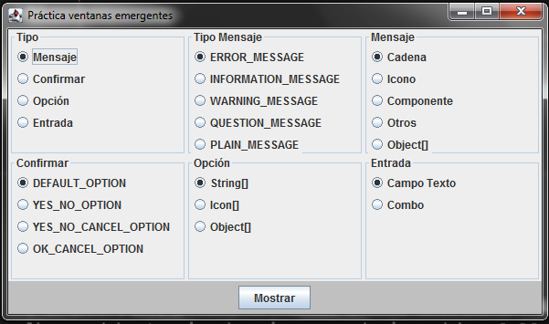

# Practica Ventanas Emergentes con Java
Práctica de Java sobre distintos tipos de ventanas emergentes con la clase JOptionPane.
Para ello, creamos un marco con lamina con grupos de JRadioButton que nos permiten seleccionar que tipo de ventana
queremos que se abra al momento de hacer click sobre el boton "Mostrar". De esa forma, podemos seleccionar que 
aparezca una ventana que simplemente muestre un mensaje, o bien una de confirmacion, de opcion o una ventana de
entrada de datos. Y cada una de ellas, tendra a su vez la opcion de mostrar un determinado mensaje (en forma de cadena
de caracteres, icono, array de objetos, entre otros), o un tipo de mensaje (de error, pregunta, advertencia, entre otros).
La idea es poder jugar con las opciones y la seleccion para ver que nuevo grafico se despliega con cada eleccion.

Esta practica fue realizada a partir del ejercicio propuesto en el curso de Java de pildorasinformaticas (canal de Youtube)

//-------Ventana Principal--------//

